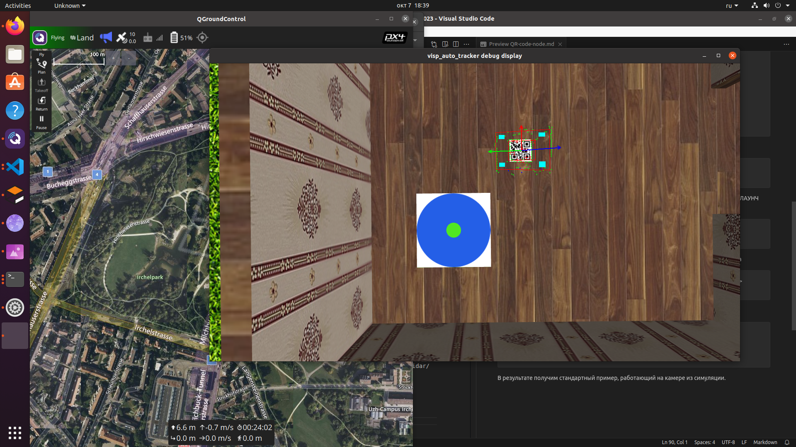

# Установка и перенаправление топиков для пакета visp_autotracker

## Установка по стандартному туториалу из росвики

https://wiki.ros.org/visp_auto_tracker

## Перенаправление потока из симуляции

Необходимо найти необходимые топики для перенаправления в лаунч файл стандартного примера юсб камеры автотрекера.

Находим топики
```
rostopic list

```

В ответ получим:
```
/clock
/gazebo/link_states
/gazebo/model_states
/gazebo/parameter_descriptions
/gazebo/parameter_updates
/gazebo/performance_metrics
/gazebo/set_link_state
/gazebo/set_model_state
/iris_rplidar/usb_cam/camera_info
/iris_rplidar/usb_cam/image_raw
/iris_rplidar/usb_cam/image_raw/compressed
/iris_rplidar/usb_cam/image_raw/compressed/parameter_descriptions
/iris_rplidar/usb_cam/image_raw/compressed/parameter_updates
/iris_rplidar/usb_cam/image_raw/compressedDepth
/iris_rplidar/usb_cam/image_raw/compressedDepth/parameter_descriptions
/iris_rplidar/usb_cam/image_raw/compressedDepth/parameter_updates
/iris_rplidar/usb_cam/image_raw/theora
/iris_rplidar/usb_cam/image_raw/theora/parameter_descriptions
/iris_rplidar/usb_cam/image_raw/theora/parameter_updates
/iris_rplidar/usb_cam/parameter_descriptions
/iris_rplidar/usb_cam/parameter_updates
/r200/camera_info
/r200/depth/image_raw
/r200/depth/points
/r200/image_raw
/r200/image_raw/compressed
/r200/image_raw/compressed/parameter_descriptions
/r200/image_raw/compressed/parameter_updates
/r200/image_raw/compressedDepth
/r200/image_raw/compressedDepth/parameter_descriptions
/r200/image_raw/compressedDepth/parameter_updates
/r200/image_raw/theora
/r200/image_raw/theora/parameter_descriptions
/r200/image_raw/theora/parameter_updates
/r200_ir/depth/camera_info
/r200_ir/parameter_descriptions
/r200_ir/parameter_updates
/rosout
/rosout_agg
/scan
/statistics
```

Для сканирования кодов нам нужна камера направленная вниз
```
/iris_rplidar/usb_cam/camera_info
/iris_rplidar/usb_cam/image_raw  
```

Далее необходимо в лаунч файле поменять параметры запуска НОДЫ, вызываемой из ЛАУНЧ файла, для этого создадим в лаунч файле дополнительный АРГУМЕНТ до вызова нод.

```
arg name="camin" />
<arg name="imra" />
```

Также в строках перенаправления топиков укажем новые топики для ноды автотрекера

```
    <remap from="/visp_auto_tracker/camera_info" to="$(arg camin)"/>
    <remap from="/visp_auto_tracker/image_raw" to="$(arg imra)"/>
```


При запуске лауч файла укажем значения аргументов
```
roslaunch visp_auto_tracker tracklive_usb.launch camin:=/iris_rplidar/usb_cam/camera_info imra:=/iris_rplidar/usb_cam/image_raw

```
В результате получим стандартный пример, работающий на камере из симуляции.




